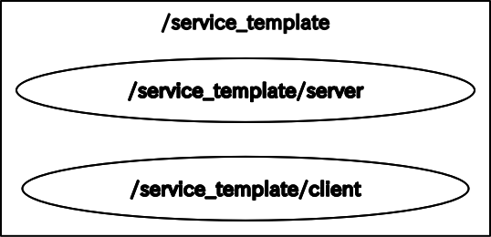
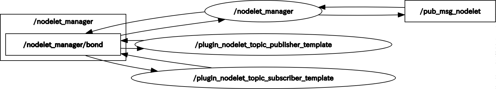

# ROS Template Programs

ROSのトピック通信、サービス通信、アクションのテンプレートプログラム

# Topic
std_msgs/String型のmessageをtopic通信

## C++
```bash
$ roslaunch ros_template_programs topic_template.launch 
```
- [topic_template.launch](/launch/topic_template.launch)
- [topic_publisher_template.cpp](/src/topic_publisher_template.cpp)
- [topic_subscriber_template.cpp](/src/topic_subscriber_template.cpp)

## Python
```bash
$ roslaunch ros_template_programs topic_template_py.launch 
```
- [topic_template_py.launch](/launch/topic_template_py.launch)
- [topic_publisher_template.py](/scripts/topic_publisher_template.py)
- [topic_subscriber_template.py](/scripts/topic_subscriber_template.py)

<div align="center">
    
</div> 

# Service
計算式を送り，計算結果を返すサービス通信

## C++
```bash
$ roslaunch ros_template_programs service_template.launch 
```
- [service_template.launch](/launch/service_template.launch)
- [service_client_template.cpp](/src/service_client_template.cpp)
- [service_server_template.cpp](/src/service_server_template.cpp)
- [Expression.msg](/msg/Expression.msg)
- [Calculation.srv](/srv/Calculation.srv)

## Python
```bash
$ roslaunch ros_template_programs service_template_py.launch 
```
- [service_template_py.launch](/launch/service_template_py.launch)
- [service_client_template.py](/scripts/service_client_template.py)
- [service_server_template.py](/scripts/service_server_template.py)
- [Expression.msg](/msg/Expression.msg)
- [Calculation.srv](/srv/Calculation.srv)

<div align="center">
    
</div> 

# Action
指定した時間だけ待機するアクション

## C++
```bash
$ roslaunch ros_template_programs action_template.launch 
```
- [action_template.launch](/launch/action_template.launch)
- [action_client_template.cpp](/src/action_client_template.cpp)
- [action_server_template.cpp](/src/action_server_template.cpp)
- [Timer.action](/action/Timer.action)

## Python
```bash
$ roslaunch ros_template_programs action_template_py.launch 
```
- [action_template_py.launch](/launch/action_template_py.launch)
- [action_client_template.py](/scripts/action_client_template.py)
- [action_server_template.py](/scripts/action_server_template.py)
- [Timer.action](/action/Timer.action)

<div align="center">
    
</div> 

# Topic(Nodelet)
Nodeletのプラグインを用いたtopic通信

## C++
```bash
$ roslaunch ros_template_programs topic_template_nodelet.launch 
```
- [topic_template_nodelet.launch](/launch/topic_template_nodelet.launch)
- [plugin_nodelet_topic_publisher_template.cpp](/src/nodelets/plugin_nodelet_topic_publisher_template.cpp)
- [plugin_nodelet_topic_subscriber_template.cpp](/src/nodelets/plugin_nodelet_topic_subscriber_template.cpp)
- [nodelet_description.xml](/nodelet_description.xml)

<div align="center">
    
</div> 

## Nodeletとは
ROSのノード間通信ではプロセス間通信のためにメモリコピーが発生し通信の遅延が存在します。  
特に画像はデータサイズが大きいために通信量や遅延が無視できない量になります。  


Nodeletを使うと記述の仕方が特殊になりますが、メモリコピー無しでノード間通信を行うことができます。  
Nodeletとは通常のROSノードに当たる機能を持ったプログラムをプラグインの形で記述して、  
実行時には複数のプラグインを1つのプロセスで実行することでメモリコピーを回避して高速化を狙うという仕組みです。  

## 参考
- [ROS講座84 Nodeletを使う](https://qiita.com/srs/items/2718feee04643b2c8afa)
